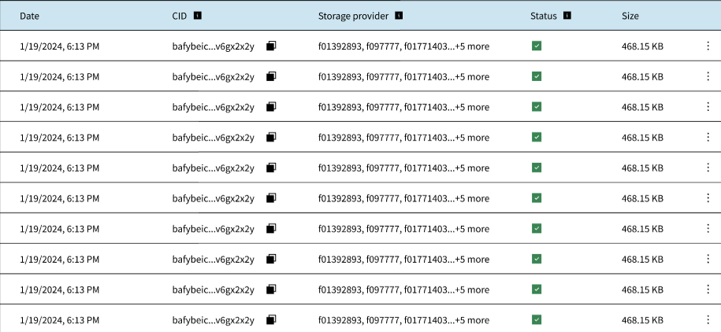

When uploading tokens to the NFT.Storage platform, it's essential to monitor their status to ensure successful storage. The table on dashboard provides insights into the **status** of each token, with three possible states: **Started**, **PinningFailed**, **InQueue**, **DataCapExceed**, and **Complete**. Understanding these states is crucial for managing your token uploads effectively.

### Started

The **Started** status indicates that the process of uploading the token to the NFT.Storage platform has begun. At this stage, the system has initiated the storage process, and the token is being processed for pinning.

### PinningFailed

The **PinningFailed** status indicates that the system encountered an error while attempting to pin the token. This error could be due to various reasons such as network issues, insufficient resources, or invalid token data. When a token's status is **PinningFailed**, it means the system was unable to complete the storage process successfully.

### InQueue

The **InQueue** status indicates that the token is queued up for processing. Tokens may enter this state when there's a backlog of uploads or when the system is experiencing high traffic. While in the queue, tokens await their turn for processing and pinning.

### DataCapExceed

The **DataCapExceed** status indicates that the token exceeds the data cap limit set by the platform. NFT.Storage imposes limits on the size of individual tokens to ensure efficient and fair usage of resources. When a token's size exceeds this limit, its status changes to **DataCapExceed**, and additional action may be required to address this issue, such as resizing the token or splitting it into smaller parts.

### Complete

The **Complete** status indicates that the token storage process has been successfully completed. Tokens with this status are securely pinned and stored on the NFT.Storage platform, ready to be accessed and retrieved as needed.

By monitoring these token status states, users can stay informed about the progress of their uploads and address any issues that may arise during the storage process effectively.
